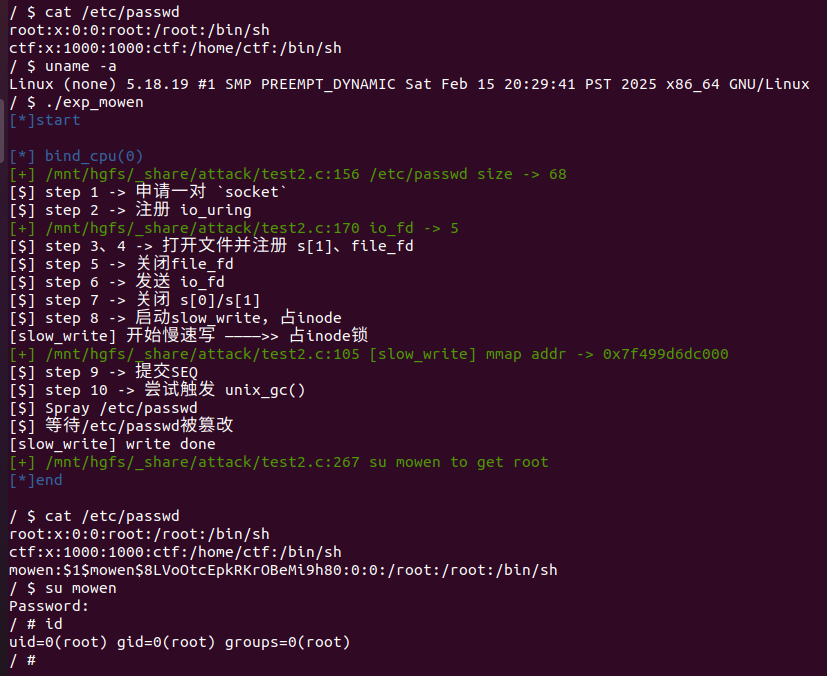
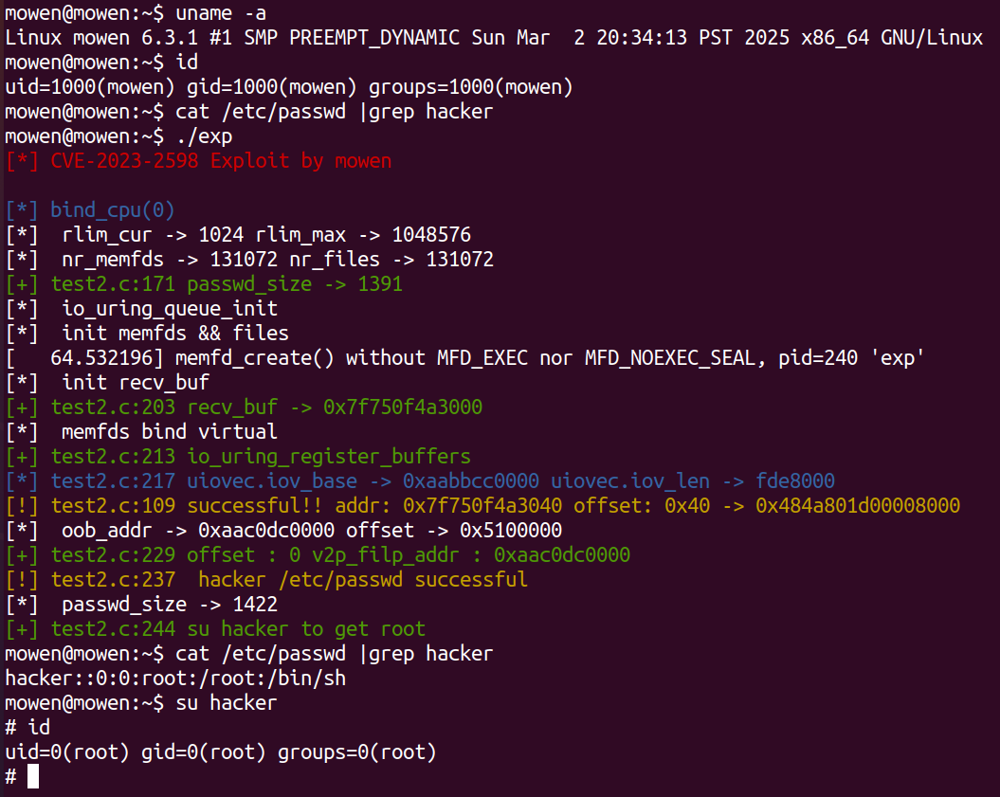
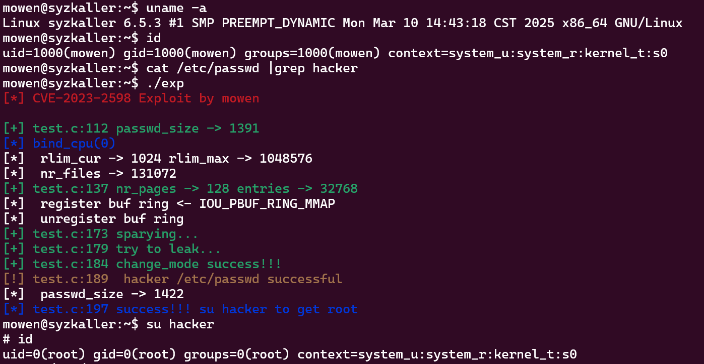

Kernel学习的一些例题
相关知识点和题解都在先知论坛：[默文 的个人主页 - 先知社区](https://xz.aliyun.com/users/154057/news)

## Catalog

1. CVE-2022-2602
1. CVE-2023-2598
1. CVE-2024-0582

------

## Detail

#### 1. CVE-2022-2602

[writeup](https://xz.aliyun.com/users/154057/news)

**Test version**: Linux-5.18.19

**Protection**: 开启KASLR/SMEP/SMAP。

**Vulnerability**: 漏洞本质是 `filp` 的 `UAF` 。 `io_uring` 模块提供的 `io_uring_register` 系统调用中的 `IORING_REGISTER_FILES` 能注册文件。调用后会把**文件**放入 `io_uring->sk->receive_queue` 。在 `Linux gc` 垃圾回收机制中又会将该列表的文件取出，尝试会将文件取出并**释放**。导致下次使用 `io_uring` 利用该文件时会触发 `UAF` 。由于UNIX_GC垃圾回收机制会错误释放 `io_uring` 中还在使用的文件结构体（正在往`"/tmp/mowen"`普通文件写入恶意数据），可以**采用DirtyCred方法**，打开大量`"/etc/passwd"`文件，覆盖刚刚释放的`file`结构体，这样最后就会实际往`"/etc/passwd"`文件写入恶意数据。

#### 2. CVE-2023-2598

[writeup](https://xz.aliyun.com/users/154057/news)

**Test version**: Linux-6.3.1

**Protection**: 开启KASLR/SMEP/SMAP。

**Vulnerability**: 漏洞本质是**物理地址越界读取(oob)**。`io_uring` 模块中提供 `io_sqe_buffers_register` 来创建一个 `Fixed Buffers` 的区域，这块区域会锁定，不能被交换，专门用来数据的读取。但是在进行连续多个大页的优化，尝试合并页的时候，使用了新机制 `folio`，`folio` 是物理内存、虚拟内存都连续的 `page` 集合，在进行页合并时只判断 `page `是否属于当前复合页，而未判断是否连续。当用户传入同一个物理地址时，长度是整个复合页长度，地址是指向一个地址，这个时候就会造成**物理地址越界读取**。

#### 3.CVE-2024-0582

[writeup](https://xz.aliyun.com/news/17217)

**Test version**: linux-6.5.3

**Protection**: 开启KASLR/SMEP/SMAP。

**Vulnerability**: 漏洞本质是 `uaf`。从内核版本 **5.7** 开始，为了便于管理不同的缓冲区集，`io_uring` 允许应用程序注册由组 ID 标识的缓冲区池。通过 `io_uring_register`的 `opcode->IORING_REGISTER_PBUF_RING`调用 `io_register_pbuf_ring()` 来完成注册ID标识缓冲区。并从内核版本 **6.4** 开始，`io_uring` 还允许用户将提供的缓冲区环的分配委托给内核，由 `IOU_PBUF_RING_MMAP`标识符即可生成。调用 `IOU_PBUF_RING_MMAP` 由内核完成分配空间后，然后使用 `mmap()`标识符映射到用户的地址,但是这个操作不会修改**页面结构(pgae)的引用计数**，然后使用 `io_unregister_pbuf_ring()`释放申请的空间的时候会调用 `put_page_testzero(page)`，对 `page` 引用`-1`并判断引用是否为 **0**，如果为 **0** 就会释放 `page` ，因为 `mmap` 映射的时候并不会**页面结构(pgae)的引用计数**，内核并不知道是否取消了内存的映射。所以就会出现映射未取消就释放 `page` 的情况，而导致用户虚拟地址对物理地址映射未取消的 `UAF` 。

